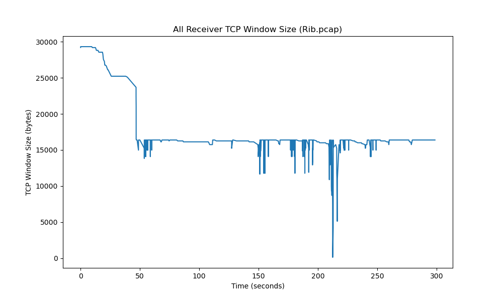

# What is PcapInspect?

PcapInspect started off life as a dirty little script to find the minimum TCP
window-size in a .pcap file from an investigation we did at Arista. As features were
added, it evolved into a useful, though still limited, script for analyzing .pcap
files.

It still requires quite a bit of work. It is being released as an open-source project
so that a team of students at a local university can do some work to improve it. If
you're interested, please do take a look, but be aware that it's a proof-of-concept
that shouldn't be relied upon for any analysis that's important to you - you have
been warned!

It currently has the ability to create graphs of selected data from .pcap files, like this:

And also the ability to generate more stats and data from the .pcap, such as unique
MAC addresses and their associated IP addresses. Here for example is some statistical
information generated about the time gap between packets sent by an Arista device and
captured in a .pcap.
    
    ...
    Arista frame time deltas
      All:
        Average frame time delta: 0.031403 (629 frames)
        Minimum delta 0.000006 at 46.820114 (frame 100)
        Maximum delta 8.052363 at 308.569725 (frame 1471)
      BGP:
        Average frame time delta: 0.957338 (18 frames)
        Minimum delta 0.000012 at 15.892623 (frame 49)
        Maximum delta 8.052363 at 308.569725 (frame 1471)
    ...

It's still fairly limited, and is currently focused on a small number of BGP and
TCP/IP features, but could be turned into a useful tool for analysis of PCAP files.

# Using PcapInspect

## Dependencies

PcapInspect requires `python3`, `matplotlib`, `numpy`, and `tshark`. As long as those
dependencies are provided, it should work. I like to use PcapInspect in a Jupyter
container which facilitates interactive python development in a browser with inline
display of output text and graphics. Installation instructions for Ubuntu, macOS and
Jupyter are [here](INSTALL.md).

## Running PcapInspect as a script

To learn more, it's probably best to just look at the [code](PcapInspect.py
"PcapInspect.py").  `PcapInspect.py` is mostly a library of classes and functions, but
there is also a small `if __name__ == "__main__":` section to test the code. Note that
this is very much geared towards the investigation which led to the initial development
of PcapInspect. It may not work with other PCAPs until further development is done.

Once you've cloned this repo and installed dependencies, it's possible that something
like the following will work if supplied with a BGP PCAP:

    ./PcapInspect.py sample_bgp_traffic.pcap --src-ip 10.10.10.101/DeviceA --src-ip 10.10.10.100/DeviceB

(Unfortunately, we are not in a position to share the .pcap file used to produce the
graph shown above and in the Jupyter notebook mentioned below.)

Note that outputs (images) are currently generated in the same directory as the .pcap file.

## Using PcapInspect in Jupyter

The [example Jupyter notebook](examples/SlowBgpUpdates/Example\ analysis\ of\ slow\ BGP\ updates\ using\ Jupyter.ipynb)
was created interactively using [Jupyter](https://jupyter.org/) running in a Docker container. The
Docker container was created by following the [PcapInspect Jupyter installation notes](INSTALL.md#jupyter).

By default in the Jupyter container, the joyvan user's home-directory contains a
'work' directory. When started in a browser, Jupyter will start in this directory. My
usual approach is to mount a directory on my server in the container and give jovyan
(i.e., the default user in the container) write access to a sub-directory called
'jovyan' where the jovyan user can clone the repo. I then create a soft-link to the
'jovyan' directory from 'work'. After this, it's possible to start using PcapInspect
after navigating to the example directory in the web-based GUI.
